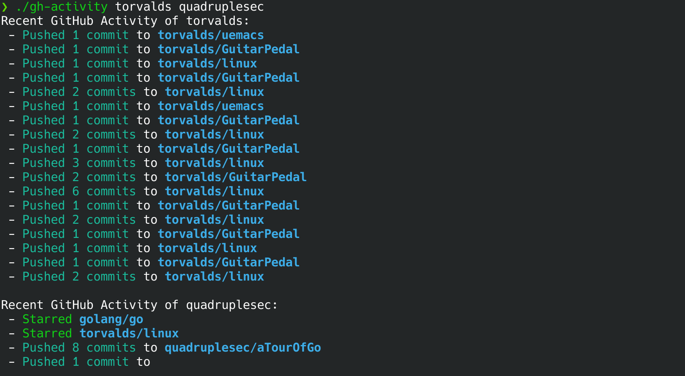

# GitHub Activity CLI (gh-activity)

[](https://github.com/quadruplesec/gh-activity/actions)
[](https://github.com/quadruplesec/gh-activity/actions)
[](https://go.dev/)
[](https://github.com/quadruplesec/gh-activity/blob/main/LICENSE)



This repository contains a command-line interface (CLI) tool written in Go that fetches, filters, and displays the recent public GitHub activity of one or multiple users directly in the terminal.

## Project Overview

This project was developed as a way to help me learn and understand the Go programming language, as well as learn more about software engineering concepts such as API integration, custom middleware, and concurrency.

This tool provides a fast, aggregated summary of a user's recent events (such as pushed commits, starred repositories, and opened issues). It is designed to be extremely fast and respectful of GitHub's API rate limits.

### Key Features

- **Concurrent Execution:** Utilizes Go's native `goroutines` and `WaitGroups` to fetch data for multiple users simultaneously, drastically reducing wait times.
- **Thread-Safe Output:** Implements Mutex locking to ensure that concurrent data streams are printed cleanly to the terminal without scrambling or overlapping.
- **Smart Caching Middleware:** Features custom `net/http` transport middleware that caches API responses locally. This speeds up consecutive queries and prevents aggressive rate-limiting from the GitHub API.
- **Custom Event Filtering:** Allows the user to filter the output by specific GitHub event types (e.g., `PushEvent`, `WatchEvent`) using command-line flags.
- **Comprehensive Unit Testing:** Includes robust test coverage for the caching middleware, data aggregation logic, and concurrent fetching engine using mock HTTP servers to prevent rate limiting.
- **Automated CI/CD Pipeline:** Integrated with GitHub Actions to automatically run unit tests on pull requests and compile release binaries across multiple operating systems on new tags.

## Installation

You can run this project either by downloading a pre-compiled binary or by building it from the source code.

### Option 1: Download Release Binaries
You can download the latest executable for your operating system and architecture directly from the [Releases](https://github.com/quadruplesec/gh-activity/releases/tag/v2.0.0) tab on GitHub.

It is recommended that you rename the downloaded file to `gh-activity` (or `gh-activity.exe` if on Windows).

### Option 2: Build from Source
Make sure you have Go installed (version 1.22+ recommended). Clone the repository and run the following command to compile the binary:

```bash
git clone [https://github.com/quadruplesec/gh-activity.git](https://github.com/quadruplesec/gh-activity.git)
cd gh-activity
go build -o gh-activity ./cmd/gh-activity
```

## Run
(After downloading or building the binary.)

To fetch the recent activity of a single GitHub user:
```bash
./gh-activity torvalds
```

### Concurrent Searching
To fetch data for multiple users at the same time, simply pass their usernames separated by a space:
```bash
./gh-activity torvalds tikastikas ken griesemer robpike
```

### Filtering Events
You can filter the output to only show specific types of GitHub events by using the -filters flag. Pass a space-separated list of event types inside quotes.

```bash
./gh-activity -filters "PushEvent WatchEvent" quadruplesec
```

For a full list of valid event types and additional help, run:

```bash
./gh-activity -h
```

## Testing

This project includes a suite of unit tests that cover the core logic, API middleware, and concurrency mechanics. The tests use mock HTTP servers, meaning they run instantly and do not require an internet connection or consume GitHub API rate limits.

To run the entire test suite locally, navigate to the root directory of the project and run:

```bash
go test -v ./...
```

## Authors
Developed by:
- Gonçalo Santana (quadruplesec) 

## Credits
This project relies on the standard Go library and the following external resources:
### APIs
- `GitHub REST API` - [https://docs.github.com/en/rest/activity/events](https://docs.github.com/en/rest/activity/events)